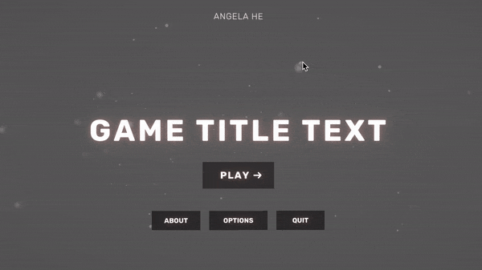

<div align="center">
  <h1>Yarn Pile</h1>
  <h4>
  A visual novel/point-and-click game template using Yarn Spinner ('develop' branch) and Unity 2020.
  </h4>
  <h3><a href="https://angelahe.dev/YarnPile/">WebGL Example</a></h3>
</div>

<div align="center">

</div>
<div align="center">

</div>

# Installation

1. Download this project
2. Open in Unity
3. Install DOTween

# Features

## General

#### Smart Syntax

- No need to explicitly state which character is saying what - if there's no character name, assumes previous
  - Example:
    ```
    Alice: Hi
    Hi, Alice is still talking
    Bob: Now Bob's talking!
    ```
- Attributes mid-dialogue using BBcode-like syntax
  - Example: `I'm [shake s=2]shaking[/shake]`
  - See `TextAttributeHandler.cs`
- Support for Rich Text tags for Text Mesh Pro (except color)
  - Example: `Player: Look! <size=150%>Big</size> text!`

#### Auto-Save/Load

See `CustomStorage.cs`, `SaveData.cs`

---

## UI/UX

- Longer pauses on punctuation
- Supports keyboard controls
- Cursor enlargens when hovering over clickable

---

## Yarn Commands/Functions

### Scene-specific

#### View Image

- Requires `VisualsManager.cs` in scene loaded with `Load` command
- `<<View {SPRITE NAME}>>`

#### Show Characters

- Requires `CharacterManager.cs` in scene loaded with `Load` command
- `<<Show {CHARACTER NAME} {EXPRESSION}>>`
- `<<Change {CHARACTER NAME} {EXPRESSION}>>`
- `<<Hide {CHARACTER NAME}>>`

### Global

#### Load Scene

- `<<Load {SCENE NAME}>>`

#### Play Music

- `<<PlayMusic {AUDIOCLIP NAME}>>`
- `<<StopMusic>>`

#### Timed or Untimed Options

- `<<SetTimed false>>`
- `<<SetTimer 2>>`

#### Display Yarn Variables

- See `RelationshipUI.cs`, `VarUI.cs`

#### Display Inventory

- `<<Take {ITEM} 1>>`
- `<<Drop {ITEM} 1>>`
- `<<if has("{ITEM}") is true>>`

#### Update In-Game Time UI

- `<<SetTime 9:45PM>>`
- `<<AddMinutes 100>>`

As well as others that are expected, like `wait`, `visited()`, etc.

# How To Add \_?

### Scenes

1. Create scene with name `{SCENE_NAME}`
2. Add Yarn node with title `{SCENE_NAME}` that contains setup commands (e.g. `PlayMusic`, `View`, etc)
3. Add objects/components necessary for your setup commands

See `Office` scene as example.

### Characters

1. Add `{CHARACTER NAME}` to `CharacterName` enum
2. Add to `CustomStorage.defaultVariables` dictionary where key is `{CHARACTER NAME}`
3. Have `CharacterManager.cs` in scene where character will appear
4. Add `Character` prefab to scene where character will appear
5. Reference this prefab instance in `CharacterManager.characterUiDictionary`
6. Replace this prefab instance's animator controller with an animator override controller, overriding the `Character` controller
7. In the new override controller, override animations you want

See `Ana` and `Hunter` in `Office` scene as examples.

_Note_: The new character will appear in the relationships UI. If this is not wanted, you can write logic for that in `RelationshipUI.cs`.

### Character Expressions

1. Add `{EXPRESSION}` to `Expression` enum
2. Add `{EXPRESSION}`trigger parameter to `Character.controller`
3. Have new trigger lead to some animation (I have all the expression animations in Sprite Layer for now)
4. For all characters that should show that expression, edit their override controllers

### Items

1. In `Scripts/Inventory/Items` folder, right click, then `Create/ScriptableObjects/ItemData`
2. Populate fields accordingly. All elements in `yarnValues` will add or subtract to the corresponding yarn variable when added or removed from inventory. **Important**: All keys in Yarn Values must be keys in `CustomStorage.defaultVariables` and represent a numerical yarn variable.

See `Headphones` as example.

### DialogueGroups

First:

1. Update `DialogueType` enum accordingly
2. Update `TextAttributeHandler.SetDialogueGivenLine`

If new DialogueGroup will show options:

3. Duplicate `ThinkDialogue` in `Main` scene.
4. Edit `CustomDialogueUI.cs.DoRunOptions` to have logic to show the new DialogueGroup.

Else:

3. Duplicate `PlayerDialogue` in `Main` scene.

_Note_: Notice `OtherDialogue` in `Main` doesn't have a `Canvas` component so it can be parented to characters. If that's the intention, perhaps duplicate that DialogueGroup instead.

### Attributes

1. Update `TextAttributeHandler attributes`
2. Update `TextAttributeHandler.HandleAttribute`

_Note:_ If want to handle attribute before `OnLineParsed` event is raised, look into `CustomDialogueUI.TryParseCharacter` logic instead.

### Parallax

Parallax effect can be achieved in several ways:

- Change Z position
- Change scale
- Change camera's field of view via Lens in `CinemachineVirtualCamera`

_Note:_ If parallaxing Unity UI, set canvas's `Render Mode` to `World Space` and set `worldCamera` to `BgCamera`.

### Non-mouse Actions

All inputs are defined in `UIActions.inputactions`.

`ClosableUI` allows for shortcut keys for closing/opening by listening to the action named `shortcutActionName`.

### Tooltips

1. In `Scripts/Inventory/Items` folder, right click, then `Create/ScriptableObjects/TooltipData`
2. Populate fields. If the `title` field corresponds to an `UIAction` action name, then the stringified action for the current input scheme will be displayed.

### Save Data

`SaveData.cs` contains all save data, and is serialized every time `DialogueRunner.onDialogueComplete` is raised.

`CustomStorage.cs` contains the logic for saving/loading `SaveData`.

To modify:

1. Edit `SaveData.cs`
2. Load data in either `UseSaveData` or `UseSaveDataOnPlay`
3. Save data in either `SaveDataListeners`, `SaveDataListenersOnPlay`, or `PrepareSaveData`

# Limitations

- CharTween can tween at max 200 characters due to DOTween's max capacity. Thus either limit all dialogue lines to <=200 characters or refactor to have effects without CharTween
- `OptionsTimed.anim` must be around 1 second
- [Inline expressions](https://yarnspinner.dev/docs/syntax/#inline-expressions) don't work (see [open issue](https://github.com/YarnSpinnerTool/YarnSpinner-Unity/issues/35))
- Option buttons must have tag "Options"
- UI, not part of a DialogueGroup, must have tag "UI"
- Background, middleground, and foreground cameras must be tagged accordingly, with the camera showing UI tagged as "MainCamera"
- For the cursor-enlargening-over-clickables effect to work, make sure only clickables are raycast targets

# Credit

Thanks to [@radiatoryang](https://github.com/radiatoryang)'s examples, [@Michsky](https://github.com/Michsky)'s lomenui, and the [Yarn Spinner](https://github.com/YarnSpinnerTool/YarnSpinner) team! I've wanted a dialogue framework that's thin and expandable yet still powerful for awhile now.

# Licensing

## Code

All scripts, shaders, and scene files are distributed under the [MIT license](LICENSE.md).

## Assets

All art assets are under exclusive copyright; they'll be used for future games. If they're used/sold, I will find you 👀

- setup:

1. download alll dependenies (with chartween modifications)
